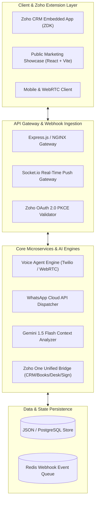

# 🏛️ System Design & Technical Architecture Specification

**System:** Zoho One Autonomous AI Voice & WhatsApp Omnichannel Platform  
**Target Scale:** 100,000+ Concurrent Conversations, <200ms API Latency  
**Author:** Mohamed Yasar ([github.com/mdyasar49](https://github.com/mdyasar49))  

---

## 1. High-Level Distributed Architecture

---

## 2. Key Engineering Highlights

### A. Sub-Second Autonomous Voice Calling Pipeline
1. **Inbound Webhook Trigger:** When a lead submits a webform or creates a CRM record, an async job is queued.
2. **Dynamic Prompt Assembly:** Customer name, company, deal value, and prior chat history are injected into the Gemini 1.5 Flash prompt.
3. **Voice Persona Synthesis:** Natural speech synthesis streamed over WebRTC / SIP trunking.
4. **Post-Call State Machine:** Automatically transitions the CRM lead status to `Demo Scheduled` and triggers a WhatsApp calendar invite.

### B. Two-Way Meta WhatsApp Cloud API Resilience
* **Webhook Signature Verification:** Cryptographic HMAC SHA-256 verification of `X-Hub-Signature-256`.
* **Idempotency Keying:** Duplicate webhook retries from Meta are deduplicated using message IDs.
* **Socket.io Live Sync:** Zero-latency UI updates to all connected Zoho CRM user sessions.

### C. Zoho Sigma Extension Architecture
* Built according to official Zoho Sigma specifications with `plugin-manifest.json` mapped to `crm.lead.rightpanel`, `crm.contact.rightpanel`, `books.invoice.detail.rightpanel`, and `desk.ticket.detail.rightpanel`.
