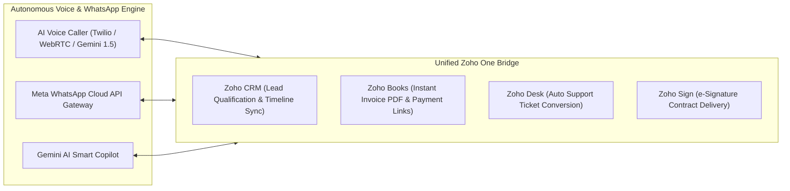

# 🎯 Executive Acquisition Pitch: Z-Agentforce Suite for Zoho One

**Presented to:** Zoho Corporate Development, Marketplace & Strategic Partnerships Team  
**Author & Developer:** Mohamed Yasar ([github.com/mdyasar49](https://github.com/mdyasar49))  
**Product Repository:** [https://github.com/mdyasar49/zoho-one-voice-whatsapp-suite](https://github.com/mdyasar49/zoho-one-voice-whatsapp-suite)  

---

## 1. Executive Summary

While **Zoho One** offers an incredible suite of 45+ business applications, today's enterprise and SMB sales landscape has moved from static forms to **real-time autonomous conversational agents**.

* **The Problem:** 78% of B2B buyers purchase from the vendor that responds first. However, human sales teams take an average of 42 minutes to contact new leads. Zoho Zia currently only offers text predictions and cannot speak, make phone calls, or natively close deals on WhatsApp.
* **The Solution:** **Z-Agentforce Suite** is an autonomous AI Voice & WhatsApp Calling Agent built natively for the Zoho One ecosystem.
* **The Impact:** Responds to new leads within **10 seconds**, holds natural multi-lingual voice conversations (English, Tamil, Hindi, Spanish), qualifies budgets, books Zoho CRM demos, and sends 1-click Zoho Books invoices on WhatsApp.

---

## 2. Competitive Landscape

| Capability | Salesforce Agentforce | Freshworks Freddy AI | Zoho (Default Zia) | **Z-Agentforce (Our Suite)** |
| :--- | :---: | :---: | :---: | :---: |
| **Autonomous Voice Phone Calling** | ✅ Yes | ⚠️ Beta | ❌ No Voice | ✅ **Yes (Instant <10s Dialing)** |
| **Multi-Lingual Vernacular (Tamil/Hindi)** | ❌ No | ❌ No | ❌ No | ✅ **Yes (Native Regional Dialects)** |
| **WhatsApp Cloud API Integration** | ⚠️ Add-on | ⚠️ Add-on | ❌ Basic | ✅ **Native 2-Way Sync** |
| **1-Click Books Invoice & Sign Bridge** | ❌ N/A | ❌ N/A | ⚠️ Manual | ✅ **1-Click WhatsApp Trigger** |

---

## 3. Product Architecture & Modules

---

## 4. Monetization & Strategic Value for Zoho

### A. ARPU Expansion on Zoho Marketplace:
* **Starter Tier ($29/mo):** WhatsApp CRM Sync + Gemini AI Drafts
* **Growth Tier ($79/mo):** Autonomous AI Voice Caller + Zoho One Cross-App Bridge
* **Enterprise Custom ($199/mo):** Custom Voice Clone + Dedicated SIP Trunks

### B. Strategic Acquisition Rationale:
1. **Immediate Competitive Parity:** Allows Zoho to leapfrog Salesforce Agentforce with voice automation tailored for high-growth markets (India, Middle East, SEA, LATAM).
2. **Zero Technical Debt:** Built using modern TypeScript/React, Zoho Embedded SDK (`ZDK`), Node.js, and official Meta Cloud APIs.
3. **Turnkey Integration:** Plugin manifest is pre-configured for direct listing on Zoho Marketplace.

---

## 5. Live Demo & Inspection

* **Repository:** `https://github.com/mdyasar49/zoho-one-voice-whatsapp-suite`
* **Local Interactive Preview:** `http://localhost:3000`
